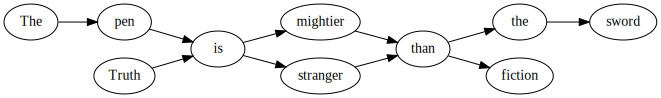

# Proverb Generator

An experiment to combine well-known sayings and quotes into new, random phrases.

## Usage

```
python proverbgenerator.py [phrase file]
```

## Examples in English

```
truth is stranger than the sword
better safe than the wicked
if it aint broke dont burn the worst
where there is a man is not gold
put your cake and let live
```

## Examples in Danish

```
blind høne kan flytte bjerge
æblet falder ikke langt fra børn leger bedst
smerte er nu altid bedst
ude spis hjemme bedst
hastværk er verdens løn
```

## How it works

Consider the following input phrases:

```
The pen is mightier than the sword
Truth is stranger than fiction
```

Treating the words as vertices in a graph, connecting the vertices using the given word sequences, we end up with a word graph like this:



By taking random paths through this graph, we can obtain interesting, strange, or funny combinations:

```
The pen is stranger than fiction
Truth is migthier than the sword
```

## Sources

This project was inspired by [Ramtin Alami: Generating inspirational quotes with Markov chains](http://www.ramtin.xyz/post/4)

Input phrases are from Wikiquote:

* [English proverbs](https://en.wikiquote.org/wiki/English_proverbs)
* [Danish proverbs](https://da.wikiquote.org/wiki/Danske_ordsprog)
